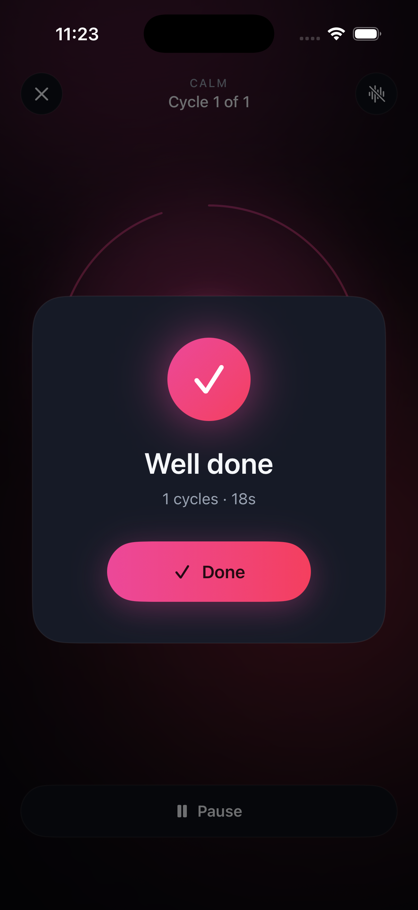
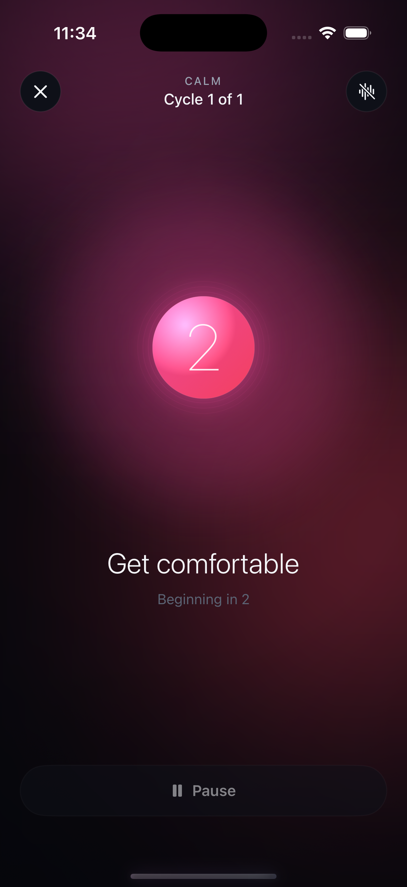
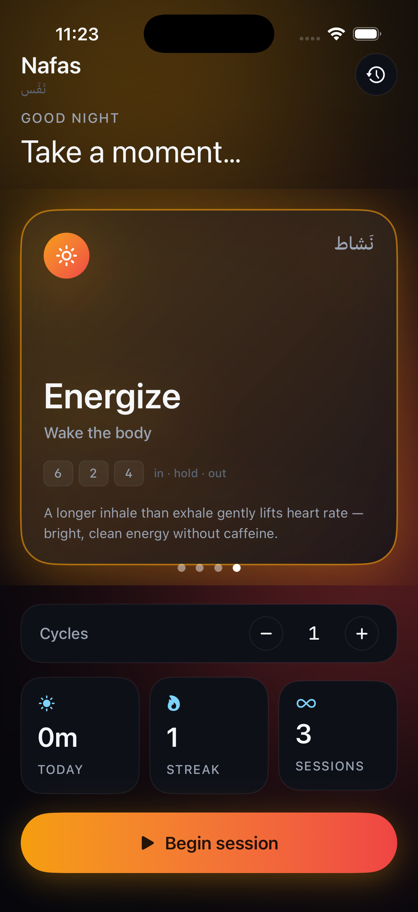
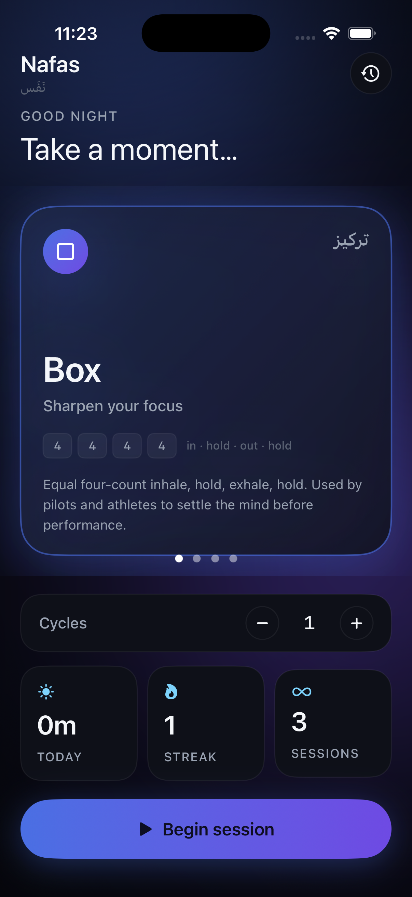
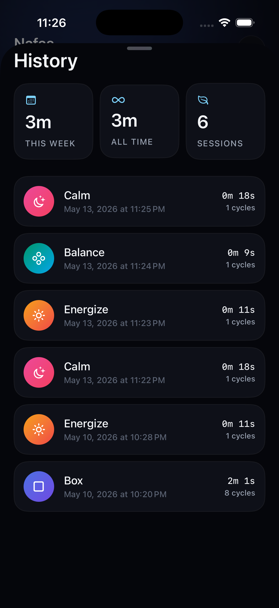

# Nafas — نَفَس

A minimal, beautifully designed breathing companion for iOS, built entirely with SwiftUI.

---

## Overview

Nafas (Arabic for *breath*) guides you through proven breathing techniques to help you focus, relax, find balance, or energize — all within a calm, distraction-free experience.

---

## Screenshots

<p align="center">
  
  &nbsp;
  
  &nbsp;
  
  &nbsp;
  
  &nbsp;
  
</p>
<p align="center">
  <sub>Home &nbsp;&nbsp;&nbsp;&nbsp;&nbsp;&nbsp;&nbsp;&nbsp;&nbsp;&nbsp; Countdown &nbsp;&nbsp;&nbsp;&nbsp;&nbsp;&nbsp;&nbsp; Session &nbsp;&nbsp;&nbsp;&nbsp;&nbsp;&nbsp;&nbsp;&nbsp; Completion &nbsp;&nbsp;&nbsp;&nbsp;&nbsp;&nbsp; History</sub>
</p>

---

## Breathing Patterns

| Pattern | Arabic | Rhythm | Purpose |
|---------|--------|--------|---------|
| **Box** | تركيز | 4 · 4 · 4 · 4 | Sharpen focus |
| **Calm** | سَكينة | 4 · 7 · 8 | Drift into rest |
| **Balance** | توازن | 5 · 5 | Find your center |
| **Energize** | نَشاط | 6 · 2 · 4 | Wake the body |

---

## Features

- **4 guided breathing patterns** — backed by research from sports science and sleep medicine
- **Glowing breath orb** — animates in sync with your inhale and exhale
- **Haptic feedback** — synchronized CoreHaptics rhythm that rises and falls with your breath
- **Session history** — tracks streaks, total minutes, and individual sessions via SwiftData
- **Ambient backgrounds** — each pattern has its own color gradient and moving glow
- **3-second prepare countdown** — gentle lead-in before every session begins
- **Pause & resume** — sessions survive interruptions
- **Dark-only UI** — deep dark palette designed for nighttime use

---

## Tech Stack

| Layer | Technology |
|-------|-----------|
| UI | SwiftUI |
| State | `@Observable` + `@Environment` |
| Persistence | SwiftData |
| Haptics | CoreHaptics |
| Min target | iOS 17 |

---

## Project Structure

```
Nafas/
├── Models/
│   ├── AppStore.swift        # Global app state (@Observable)
│   ├── BreathPattern.swift   # Pattern definitions & phase logic
│   └── BreathSession.swift   # SwiftData model for session history
├── Views/
│   ├── HomeView.swift        # Pattern carousel + session launcher
│   ├── SessionView.swift     # Full-screen active session
│   ├── HistoryView.swift     # Past sessions & lifetime stats
│   ├── RootView.swift        # Navigation coordinator
│   └── Components/
│       ├── BreathOrb.swift   # Animated glowing orb
│       ├── PatternCard.swift # Card in the home carousel
│       └── Chrome.swift      # Shared UI components
├── Services/
│   └── Haptics.swift         # CoreHaptics wrapper
├── Theme/
│   └── Theme.swift           # Colors, fonts, spacing tokens
└── Resources/
    ├── Assets.xcassets
    └── Info.plist
```

---

## Getting Started

1. Clone the repo
2. Open `Nafas.xcodeproj` in Xcode 15 or later
3. Select a simulator or device running iOS 17+
4. Build and run (`⌘R`)

No external dependencies — everything uses Apple frameworks only.

---

## License

MIT
